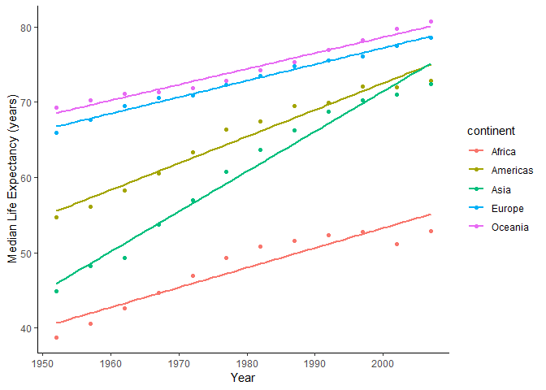
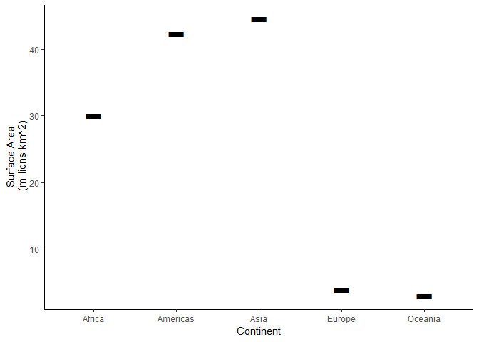

Homework 4: Tidy data and joins
================
Jessica Schaub
September 27, 2018

Overview
--------

-   Introduction
-   Load Packages
-   Choosing Tasks
-   Task 1: Compute a measure of life expectancy for all possible combinations of year and continent. Reshape for one row per year and one variable per continent.
-   Task 2: Create a second data frame that complements `gapminder`, then join it with a part of `gapminder` and make some observations about the results and process.

### Introduction

For this assignment, we will solidify our data wrangling skills. We are required to complete two tasks, one where we do some data re-shaping, and one where we perform a join. For more information, please see the [assignment](http://stat545.com/Classroom/assignments/hw04/hw04.html).

### Load Packages

The required packages for this assignment are loaded here.

``` r
# tidyverse
suppressPackageStartupMessages(library(tidyverse))
# knitr
suppressPackageStartupMessages(library(knitr))
#gapminder
suppressPackageStartupMessages(library(gapminder))
```

### Choosing Tasks

I have chosen to tackle the following tasks.

Reshaping: Activity 3 (Compute a measure of life expectancy for all possible combinations of year and continent. Reshape for one row per year and one variable per continent)

Joining: Activity 1 (Create a second data frame that complements `gapminder`, then join it with a part of `gapminder` and make some observations about the results and process)

#### Task 1: Activity 3

For this activity, we are tasked with computing a measure of life expectancy for all possible combinations of year and continent. I will calculate the *median* of life expectancy between countries. Then we need to reshape the data to one row per year and one variable per continent.

##### Method

1.  Calculate median value of life expectancy for each continent and for each year
2.  Reshape the data
3.  View in table and plot

##### Table

``` r
life_exp <- gapminder %>% #save to variable for plotting
  group_by(continent, year) %>%    # separate by continent and year
  summarise(med=round(median(lifeExp), 1)) #calculate median life expectancy

life_exp %>%
  spread(key = continent, value = med) %>% #reshape to untidy form
  kable()
```

|  year|  Africa|  Americas|  Asia|  Europe|  Oceania|
|-----:|-------:|---------:|-----:|-------:|--------:|
|  1952|    38.8|      54.7|  44.9|    65.9|     69.3|
|  1957|    40.6|      56.1|  48.3|    67.7|     70.3|
|  1962|    42.6|      58.3|  49.3|    69.5|     71.1|
|  1967|    44.7|      60.5|  53.7|    70.6|     71.3|
|  1972|    47.0|      63.4|  57.0|    70.9|     71.9|
|  1977|    49.3|      66.4|  60.8|    72.3|     72.9|
|  1982|    50.8|      67.4|  63.7|    73.5|     74.3|
|  1987|    51.6|      69.5|  66.3|    74.8|     75.3|
|  1992|    52.4|      69.9|  68.7|    75.5|     76.9|
|  1997|    52.8|      72.1|  70.3|    76.1|     78.2|
|  2002|    51.2|      72.0|  71.0|    77.5|     79.7|
|  2007|    52.9|      72.9|  72.4|    78.6|     80.7|

##### Plot

``` r
#Plot median life expectancy by year for each continent
ggplot(life_exp, aes(x = year, y = med, color = continent)) +
  geom_point() +
  geom_smooth(method = lm, se = FALSE) + #plotting linear trendline
  ylab("Median Life Expectancy (years)") +
  xlab("Year") +
  theme_classic() #changing to a cleaner look
```



##### Observations

1.  It is easier to find one specific value when the data is in untidy form (example: Europe in 1992).
2.  Median life expectancy increases with time for every continent.
3.  Computing only one value for life expectancy removes our ability to view the spread of the data in a plot, but makes a table more readable.

#### Task 2: Activity 1

For this activity, we are tasked with creating a second data frame to complement `gapminder`, then joining it with a portion of the `gapminder` data set. We finish with some observations about the process and results.

##### Method

1.  Create complimentary data set (Surface area of each continent)
2.  Join this data to gapminder by continent
3.  View the results in a table and in a plot

##### Table

``` r
# Create new complimentary data set
# Contains information about the surface area of each continent, in million km^2 (sa)

# Make the variables containing the information
continent <- c("Asia", "Americas", "Europe", "Oceania", "Africa")
sa <- c(44.58, 42.38, 3.84, 2.97, 30.07)

# Put together in a data frame
sa_data <- data.frame(continent, sa)

# Bind to gapminder and save as variable for plotting
# Notice: "continent" is conserved
new_gapminder <- left_join(gapminder, sa_data)
```

    ## Joining, by = "continent"

``` r
#View the table, only the first 50 rows for simplicity
# Notice: the values are repeated when the continent is repeated
new_gapminder %>% 
  head(50) %>% 
  kable(col.names = c("Country", "Continent", "Year", "Life Expectancy", "Population", "GDP per Capita", "Surface Area (mil. km^2)"))
```

| Country     | Continent |  Year|  Life Expectancy|  Population|  GDP per Capita|  Surface Area (mil. km^2)|
|:------------|:----------|-----:|----------------:|-----------:|---------------:|-------------------------:|
| Afghanistan | Asia      |  1952|           28.801|     8425333|        779.4453|                     44.58|
| Afghanistan | Asia      |  1957|           30.332|     9240934|        820.8530|                     44.58|
| Afghanistan | Asia      |  1962|           31.997|    10267083|        853.1007|                     44.58|
| Afghanistan | Asia      |  1967|           34.020|    11537966|        836.1971|                     44.58|
| Afghanistan | Asia      |  1972|           36.088|    13079460|        739.9811|                     44.58|
| Afghanistan | Asia      |  1977|           38.438|    14880372|        786.1134|                     44.58|
| Afghanistan | Asia      |  1982|           39.854|    12881816|        978.0114|                     44.58|
| Afghanistan | Asia      |  1987|           40.822|    13867957|        852.3959|                     44.58|
| Afghanistan | Asia      |  1992|           41.674|    16317921|        649.3414|                     44.58|
| Afghanistan | Asia      |  1997|           41.763|    22227415|        635.3414|                     44.58|
| Afghanistan | Asia      |  2002|           42.129|    25268405|        726.7341|                     44.58|
| Afghanistan | Asia      |  2007|           43.828|    31889923|        974.5803|                     44.58|
| Albania     | Europe    |  1952|           55.230|     1282697|       1601.0561|                      3.84|
| Albania     | Europe    |  1957|           59.280|     1476505|       1942.2842|                      3.84|
| Albania     | Europe    |  1962|           64.820|     1728137|       2312.8890|                      3.84|
| Albania     | Europe    |  1967|           66.220|     1984060|       2760.1969|                      3.84|
| Albania     | Europe    |  1972|           67.690|     2263554|       3313.4222|                      3.84|
| Albania     | Europe    |  1977|           68.930|     2509048|       3533.0039|                      3.84|
| Albania     | Europe    |  1982|           70.420|     2780097|       3630.8807|                      3.84|
| Albania     | Europe    |  1987|           72.000|     3075321|       3738.9327|                      3.84|
| Albania     | Europe    |  1992|           71.581|     3326498|       2497.4379|                      3.84|
| Albania     | Europe    |  1997|           72.950|     3428038|       3193.0546|                      3.84|
| Albania     | Europe    |  2002|           75.651|     3508512|       4604.2117|                      3.84|
| Albania     | Europe    |  2007|           76.423|     3600523|       5937.0295|                      3.84|
| Algeria     | Africa    |  1952|           43.077|     9279525|       2449.0082|                     30.07|
| Algeria     | Africa    |  1957|           45.685|    10270856|       3013.9760|                     30.07|
| Algeria     | Africa    |  1962|           48.303|    11000948|       2550.8169|                     30.07|
| Algeria     | Africa    |  1967|           51.407|    12760499|       3246.9918|                     30.07|
| Algeria     | Africa    |  1972|           54.518|    14760787|       4182.6638|                     30.07|
| Algeria     | Africa    |  1977|           58.014|    17152804|       4910.4168|                     30.07|
| Algeria     | Africa    |  1982|           61.368|    20033753|       5745.1602|                     30.07|
| Algeria     | Africa    |  1987|           65.799|    23254956|       5681.3585|                     30.07|
| Algeria     | Africa    |  1992|           67.744|    26298373|       5023.2166|                     30.07|
| Algeria     | Africa    |  1997|           69.152|    29072015|       4797.2951|                     30.07|
| Algeria     | Africa    |  2002|           70.994|    31287142|       5288.0404|                     30.07|
| Algeria     | Africa    |  2007|           72.301|    33333216|       6223.3675|                     30.07|
| Angola      | Africa    |  1952|           30.015|     4232095|       3520.6103|                     30.07|
| Angola      | Africa    |  1957|           31.999|     4561361|       3827.9405|                     30.07|
| Angola      | Africa    |  1962|           34.000|     4826015|       4269.2767|                     30.07|
| Angola      | Africa    |  1967|           35.985|     5247469|       5522.7764|                     30.07|
| Angola      | Africa    |  1972|           37.928|     5894858|       5473.2880|                     30.07|
| Angola      | Africa    |  1977|           39.483|     6162675|       3008.6474|                     30.07|
| Angola      | Africa    |  1982|           39.942|     7016384|       2756.9537|                     30.07|
| Angola      | Africa    |  1987|           39.906|     7874230|       2430.2083|                     30.07|
| Angola      | Africa    |  1992|           40.647|     8735988|       2627.8457|                     30.07|
| Angola      | Africa    |  1997|           40.963|     9875024|       2277.1409|                     30.07|
| Angola      | Africa    |  2002|           41.003|    10866106|       2773.2873|                     30.07|
| Angola      | Africa    |  2007|           42.731|    12420476|       4797.2313|                     30.07|
| Argentina   | Americas  |  1952|           62.485|    17876956|       5911.3151|                     42.38|
| Argentina   | Americas  |  1957|           64.399|    19610538|       6856.8562|                     42.38|

##### Plot

``` r
# Plot the data to view the difference in SA between continents
new_gapminder %>% 
  select("continent", "sa") %>%    #filters data for only continent and sa columns
  distinct() %>%   #removes duplicate rows, pipe into ggplot for plotting
  ### Plotting begins here
  ggplot(aes(continent, sa)) +
  geom_point(pch = "-", size = 20) +
  ylab("Surface Area\n (millions km^2)") +
  xlab("Continent") +
  theme_classic()
```



##### Observations

1.  You can join tables of different size and dplyr is smart enough to duplicate or insert NA's for missing/extra values
